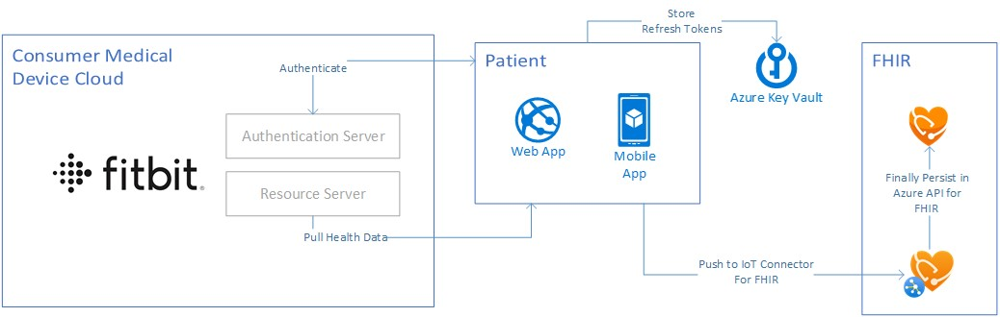
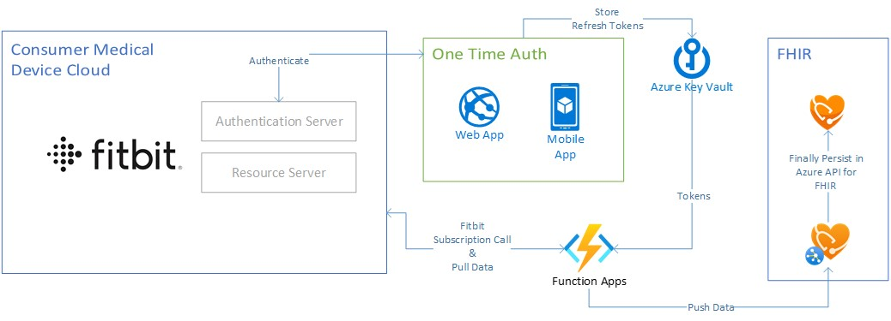

# Fitbit on FHIR

> This repo has been populated by two main projects to help you get started with bringing Fitbit to FHIR. The webapp to help you authenticate your patients with
> the Fitbit API and the Function that continously downloads patient data as it becomes available.

## Authentication and One Time Sync Webapp

The webapp is appropriate for anyone trying to quickly deploy a solution where they would like to ingest historical patient data (30 days be default) from Fitbit and into FHIR.

### Quickstart

Deploy this project directly to Azure:

or you can deploy the app yourself using [this guide](http://...).

## Adding continuos monitoring using an Azure function

This is the extended architecture, it adds a an azure function that is triggered by Fitbit whenever data is synced by an authorized user.

## Contributing

This project welcomes contributions and suggestions.  Most contributions require you to agree to a
Contributor License Agreement (CLA) declaring that you have the right to, and actually do, grant us
the rights to use your contribution. For details, visit https://cla.opensource.microsoft.com.

When you submit a pull request, a CLA bot will automatically determine whether you need to provide
a CLA and decorate the PR appropriately (e.g., status check, comment). Simply follow the instructions
provided by the bot. You will only need to do this once across all repos using our CLA.

This project has adopted the [Microsoft Open Source Code of Conduct](https://opensource.microsoft.com/codeofconduct/).
For more information see the [Code of Conduct FAQ](https://opensource.microsoft.com/codeofconduct/faq/) or
contact [opencode@microsoft.com](mailto:opencode@microsoft.com) with any additional questions or comments.

## Trademarks

This project may contain trademarks or logos for projects, products, or services. Authorized use of Microsoft 
trademarks or logos is subject to and must follow 
[Microsoft's Trademark & Brand Guidelines](https://www.microsoft.com/en-us/legal/intellectualproperty/trademarks/usage/general).
Use of Microsoft trademarks or logos in modified versions of this project must not cause confusion or imply Microsoft sponsorship.
Any use of third-party trademarks or logos are subject to those third-party's policies.
