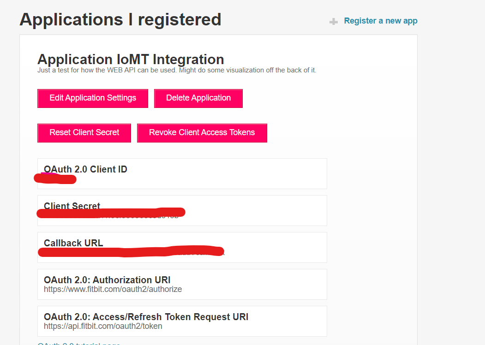

# Setup #

Before you begin your Fitbit on FHIR deployment, you'll need to set up a Fitbit developer account. This will enable you to do two key things.

Firstly, you'll the application will be able to authenticate on behalf of the user which in turn allows the application to make calls to the Fitbit web API. This API is where we are able to gather data related to our patients from which we will create observations.

Secondly, using these credentials we are able to create what we call a subscription with Fitbit. This is an instruction set to the Fitbit Server informing it that we would like to know about updates related to a user. For example, if the user has recently synced with their device and provided fresh activity, sleep, heartrate data. 

### App Registration ###

1. Before you can register an application, you'll need a Fitbit account. This will be useful later on for testing anyway. You can create an account [here](http://fitbit.com/ "Fitbit Homepage").
1. Once you have registered you can move on to [registering your application](https://dev.fitbit.com/apps/new "Register New App"). Take a second to review the information below before moving on.

Now, there are three types of Fitbit applications. However, only two that we care about: 
- Personal
- Server

*Personal:* This application type is mainly for testing, it allows you to access **all** the API endpoints, however, only for the user that registered the application. So you *will* run into an error if you try and run this project with multiple users using this setting.

*Server:* This is the type you can use for production, it will allow you to access the endpoints on behalf of any Fitbit user. However, not all endpoints are accessible by default. You will need to fill in [this form](https://dev.fitbit.com/build/reference/web-api/intraday-requests/ "Server Registration") if you want to access certain data such as heart rate.

3. After registering your application you'll be greeted with your connection data. Take note of this you will need it soon.

