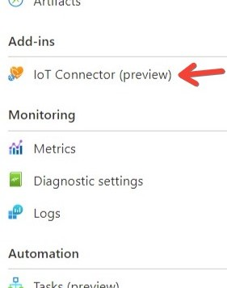
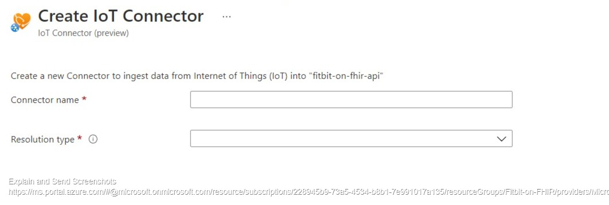

## Guide to Deploying The Fitbit on FHIR webapp

## installation 

For added security we still rely on a key vault to store our user's refresh tokens. However if you'd like to run this project completely locally then you can skip the Azure section and head to the Local Extended section. 

### Local

Clone the library and head to the web app dir.

```PowerShell
git clone https://github.com/microsoft/FitbitOnFHIR
cd .\FitbitOnFHIR\webapp\
```

setting up your local virtual environment and installing all the dependencies you'll need.

```PowerShell
python -m venv venv
.\venv\Scripts\activate
pip install -r requirements.txt
```

### Azure Key Vault

Run the `login` command.
```azurecli-interactive
az login
```

If the CLI can open your default browser, it will do so and load an Azure sign-in page.

Otherwise, open a browser page at [https://aka.ms/devicelogin](https://aka.ms/devicelogin) and enter the
authorization code displayed in your terminal.

Use the `az group create` command to create a resource group:

```azurecli-interactive
az group create --name fitbitOnFHIR-rg --location eastus
```

Let's create the Key Vault itself:

```azurecli-interactive
az keyvault create --name <your-unique-keyvault-name> --resource-group fitbitOnFHIR-rg
```

Grant access to your key vault:

```Powershell
az keyvault set-policy --name <YourKeyVaultName> --upn user@domain.com --secret-permissions delete get list set
```

Store the key vault name in your as an environmental variable


```Powershell
$Env:KEY_VAULT_NAME="<your-key-vault-name>"
```

Visit your azure portal and navigate to your newly created Key Vault. Go ahead and and create two secrets; their values are equal to the values you got received from your Fitbit App Registration.

- fitbitClientId
- fitbitClientSecret

## Azure IoT Connector for FHIR 

1. If you haven't deployed a FHIR instance then you can learn how to do so [here](https://docs.microsoft.com/en-us/azure/healthcare-apis/fhir-paas-cli-quickstart).
1. Next let's provision an IoT connector, the easiest way to do so is to navigate to the portal and into your FHIR API instance. Select the IoT Connector under "Add-ins" from the left-hand panel. 



3. Name the IoT Connector and select create as the Resolution type.

